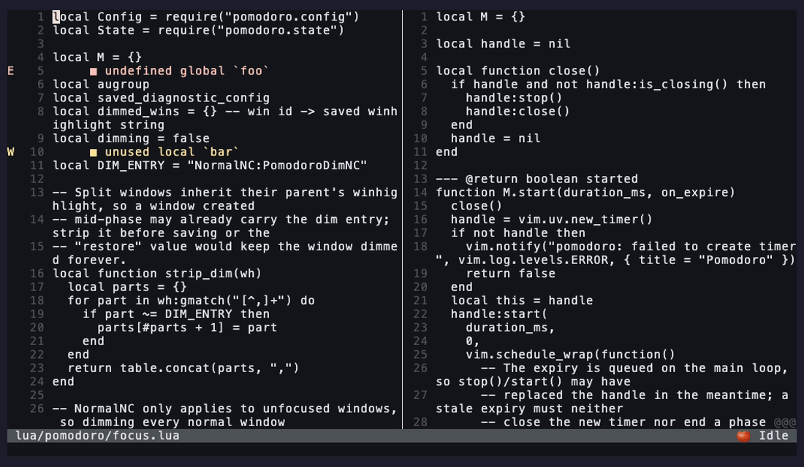

<div align="center">

# pomodoro.nvim

**A focus-first Pomodoro timer for developers who live in Neovim.**

_Work / break cycles, editor-native notifications, per-day stats, an opt-in focus mode that mutes distractions while you ship._

[](https://neovim.io)
[](https://www.lua.org/)
[](https://github.com/yal212/pomodoro.nvim/actions)
[](./LICENSE)
[](https://github.com/yal212/pomodoro.nvim/stargazers)

[Features](#-features) ·
[Focus mode](#-focus-mode) ·
[Install](#-installation) ·
[Quickstart](#-quickstart) ·
[Config](#-configuration) ·
[Commands](#-commands) ·
[API](#-lua-api) ·
[Recipes](#-recipes) ·
[FAQ](#-faq)

</div>

---

<div align="center">


<sub>Timer sped up for the demo. Reproduce it anytime: <code>vhs scripts/demo.tape</code></sub>

</div>

## ✨ Features

- 🍅 **Classic Pomodoro cycles** — 25 / 5 / 15 minute defaults, long break every 4th work block, all configurable
- ⏱️ **One-off durations** — `:Pomodoro start 45` runs a single 45-minute block without touching your config
- 🔔 **Editor-native notifications** — `vim.notify` (lights up [`nvim-notify`](https://github.com/rcarriga/nvim-notify) / [`noice`](https://github.com/folke/noice.nvim) automatically) and/or a transient floating window
- 📊 **Per-day stats** — completed work blocks, focused minutes, long-break count, persisted atomically as JSON
- 📅 **History & streaks** — `:Pomodoro history` floats the last N days; streaks track consecutive days hitting your goal
- 🔉 **Sound alerts (opt-in)** — play any system command on phase end; sensible macOS default
- 🪟 **Toggleable status window** — pinned, borderless card with phase-colored header, live progress bar, and today counter
- 🛎️ **Continue / stop prompt** — when auto-start is off, each phase ends with a `vim.ui.select` asking whether to begin the next phase or stop
- 🎯 **Focus mode (opt-in)** — block configured `:` commands during work; optionally mute diagnostics
- 🧩 **Renderer-agnostic statusline** — drop-in component for `lualine`, `heirline`, or your own `statusline`
- 🔭 **Optional Telescope picker** — last 30 days at a glance, only loaded if Telescope is present
- 🪝 **Hooks** — `on_work_start`, `on_break_start`, `on_cycle_complete`, … wire your own behavior
- 🪶 **Zero required dependencies** — pure Lua, stdlib only
- ✅ **Tested** — 80 plenary-busted specs, CI on stable + nightly Neovim

## 🎯 Focus mode

_The feature this plugin exists for._ A timer in your menu bar is easy to ignore — and it does nothing about the distraction that actually gets you, which is **the editor itself**. Focus mode makes a work block mean something.

<div align="center">



<sub>Timer sped up for the demo. Reproduce it anytime: <code>vhs scripts/demo_focus.tape</code></sub>

</div>

While a **work** phase is running, focus mode can:

- **Block `:` commands you name** — reach for `:Lazy` mid-flow and Neovim politely refuses
- **Silence diagnostics** — no wall of red baiting you into a cleanup detour (signs stay, virtual text goes)
- **Dim inactive windows** — attention stays on the buffer you're actually working in

The moment the break starts, everything comes back exactly as it was. It's **opt-in and off by default**:

```lua
require("pomodoro").setup({
  focus = {
    enabled            = true,
    blocked_commands   = { "Lazy", "Mason", "Telescope" },  -- your rabbit holes
    silent_diagnostics = true,
    dim_inactive       = true,
  },
})
```

## 📦 Requirements

- **Neovim** ≥ 0.10
- _Optional_ — [`telescope.nvim`](https://github.com/nvim-telescope/telescope.nvim) for the stats picker
- _Optional_ — [`nvim-notify`](https://github.com/rcarriga/nvim-notify) for prettier toasts (any `vim.notify` replacement works)

## 📥 Installation

<details open>
<summary><b>lazy.nvim</b></summary>

```lua
{
  "yal212/pomodoro.nvim",
  cmd = "Pomodoro",
  ---@type pomodoro.Config
  opts = {
    -- your config; see :help pomodoro-config
  },
}
```

</details>

<details>
<summary><b>packer.nvim</b></summary>

```lua
use({
  "yal212/pomodoro.nvim",
  config = function()
    require("pomodoro").setup({})
  end,
})
```

</details>

<details>
<summary><b>vim-plug</b></summary>

```vim
Plug 'yal212/pomodoro.nvim'

" In your init.lua, after plug#end():
lua require("pomodoro").setup({})
```

</details>

## 🚀 Quickstart

```vim
:Pomodoro start          " 25-minute work block
:Pomodoro start 45       " one-off 45-minute work block
:Pomodoro skip           " end current phase, advance to next (doesn't count it)
:Pomodoro restart        " restart current phase from the beginning
:Pomodoro status         " toggle floating status window
:Pomodoro pause          " pause; remaining time preserved
:Pomodoro resume
:Pomodoro stop
:Pomodoro stats          " today + last 7 days + streak
:Pomodoro history        " last 14 days in a float (q/<Esc> closes)
```

Subcommands are case-insensitive — `:Pomodoro Start` works too — and `<Tab>` completes them.

Suggested keymaps:

```lua
local map = vim.keymap.set
map("n", "<leader>ps", "<cmd>Pomodoro start<cr>",  { desc = "Pomodoro: start" })
map("n", "<leader>pp", "<cmd>Pomodoro pause<cr>",  { desc = "Pomodoro: pause" })
map("n", "<leader>pr", "<cmd>Pomodoro resume<cr>", { desc = "Pomodoro: resume" })
map("n", "<leader>px", "<cmd>Pomodoro stop<cr>",   { desc = "Pomodoro: stop" })
map("n", "<leader>pw", "<cmd>Pomodoro status<cr>", { desc = "Pomodoro: window" })
map("n", "<leader>pS", "<cmd>Pomodoro stats<cr>",  { desc = "Pomodoro: stats" })
```

## ⚙️ Configuration

`setup()` is **not** required — `:Pomodoro` initializes itself with defaults on first use. Pass any subset of the table below to override.

<details>
<summary><b>Click to view all defaults</b></summary>

```lua
require("pomodoro").setup({
  -- Phase durations (minutes)
  durations = {
    work        = 25,
    short_break = 5,
    long_break  = 15,
  },

  -- Long break every Nth completed work block
  cycles_per_long_break = 4,

  -- Target work blocks per day (0 = disabled)
  daily_goal = 0,

  -- Phase transition behavior
  auto_start_break = true,   -- break begins immediately; if false a Continue/Stop prompt appears
  auto_start_work  = false,  -- next work block requires :Pomodoro start (or Continue from prompt)

  -- Notification channels (any subset, in display order)
  notify_styles = { "vim_notify", "float" },
  notify = {
    float_duration_ms = 4000,
  },

  -- Opt-in sound on phase end (not played on skip)
  sound = {
    enabled = false,
    cmd     = nil,  -- string (run via sh -c) or argv table, e.g. { "paplay", "/path/ding.wav" }
                    -- nil → afplay with a system sound on macOS
  },

  -- Statusline component appearance
  statusline = {
    icon            = "",
    show_when_idle  = false,
    format          = "%s %s",     -- icon, body
    refresh_ms      = 250,         -- live tick while a phase is running
    condition       = nil,         -- function(ctx) return boolean end
  },

  -- Toggleable pinned status window (borderless card)
  status_window = {
    border             = "none",
    width              = 36,
    height             = 5,
    anchor             = "NE",
    row                = 1,
    col_offset         = 2,
    refresh_ms         = 250,
    show_progress_bar  = true,
    show_today         = true,
    title              = nil,      -- optional float title, e.g. " pomodoro "
    title_pos          = "center", -- "left" | "center" | "right"
    icons = {
      work        = "▶",
      short_break = "•",
      long_break  = "★",
      paused      = "❚❚",
      idle        = "○",
    },
  },

  -- Opt-in focus enforcement
  focus = {
    enabled            = false,
    blocked_commands   = {},  -- e.g. { "Lazy", "Mason", "Telescope" }
    silent_diagnostics = false,
    dim_inactive       = false,
  },

  -- JSON stats on disk
  persistence = {
    enabled = true,
    path    = nil,            -- nil → vim.fn.stdpath('data') .. '/pomodoro/stats.json'
  },

  -- Lifecycle hooks
  hooks = {
    on_work_start     = nil,  -- function(payload) end
    on_work_end       = nil,
    on_break_start    = nil,
    on_break_end      = nil,
    on_cycle_complete = nil,
  },
})
```

</details>

## 📋 Commands

Everything lives under a single `:Pomodoro {subcommand}` command. Subcommands are case-insensitive (`:Pomodoro Start` == `:Pomodoro start`) and `<Tab>`-completable.

| Subcommand | Args | Description |
| :--- | :--- | :--- |
| `:Pomodoro start`  | `[work\|short\|long\|{minutes}]` | Start a phase. Defaults to next in cycle, or resumes if paused. A number starts a one-off work block of that length. |
| `:Pomodoro pause`  | — | Pause the active phase, preserving remaining time. |
| `:Pomodoro resume` | — | Resume a paused phase. |
| `:Pomodoro stop`   | — | Stop and reset to idle. |
| `:Pomodoro skip`   | — | End the current phase immediately and advance. Skipped work blocks are **not** counted in stats or hooks. |
| `:Pomodoro restart` | — | Restart the current phase from the beginning. |
| `:Pomodoro status` | — | Toggle the floating status window. |
| `:Pomodoro stats`  | — | Show today + last 7 days summary and current streak. |
| `:Pomodoro history` | `[{days}]` | Float the last N days (default 14). Close with `q` or `<Esc>`. |
| `:Pomodoro reset`  | — | Wipe persisted stats (with confirm prompt). |

## 🧰 Lua API

```lua
local pomo = require("pomodoro")

pomo.setup({})                           -- merge config (idempotent)
pomo.start("work" | "short" | "long" | nil)
pomo.start(45)                           -- one-off 45-minute work block
pomo.pause()
pomo.resume()
pomo.stop()
pomo.skip()
pomo.restart()
pomo.status()                            -- toggle status window
pomo.stats_summary()                     -- print today + week + streak via vim.notify
pomo.history(14)                         -- float the last 14 days
pomo.reset_stats()
pomo.statusline()                        -- string for your statusline

-- Lower level
require("pomodoro.statusline").component()         -- string
require("pomodoro.statusline").component_lualine() -- { text, hl }
require("pomodoro.stats").today()                  -- table
require("pomodoro.stats").last_n_days(7)           -- table[]
require("pomodoro.stats").streak(goal)             -- consecutive days meeting goal
```

## 🍳 Recipes

<details open>
<summary><b>Lualine — drop-in</b></summary>

```lua
require("lualine").setup({
  sections = {
    lualine_x = {
      function() return require("pomodoro.statusline").component() end,
      "encoding", "fileformat", "filetype",
    },
  },
})
```

</details>

<details>
<summary><b>Lualine — colored by phase</b></summary>

```lua
local function pomo()
  local s = require("pomodoro.statusline").component_lualine()
  if s.text == "" then return "" end
  return "%#" .. s.hl .. "#" .. s.text
end

require("lualine").setup({
  sections = { lualine_x = { pomo, "filetype" } },
})
```

</details>

<details>
<summary><b>Native statusline (no plugin)</b></summary>

```lua
vim.o.statusline = "%f %m %= %{v:lua.require('pomodoro').statusline()} "
```

</details>

<details>
<summary><b>System notification on break (macOS)</b></summary>

```lua
require("pomodoro").setup({
  hooks = {
    on_break_start = function(p)
      vim.fn.jobstart({
        "terminal-notifier",
        "-title", "Pomodoro",
        "-message", "Break time — " .. p.duration_min .. " min",
        "-sound", "Glass",
      })
    end,
  },
})
```

</details>

<details>
<summary><b>System notification on break (Linux)</b></summary>

```lua
require("pomodoro").setup({
  hooks = {
    on_break_start = function(p)
      vim.fn.jobstart({ "notify-send", "Pomodoro", "Break — " .. p.duration_min .. " min" })
    end,
  },
})
```

</details>

<details>
<summary><b>Lock yourself out of distractions while working</b></summary>

```lua
require("pomodoro").setup({
  focus = {
    enabled = true,
    blocked_commands   = { "Lazy", "Mason", "Telescope" },
    silent_diagnostics = true,
    dim_inactive       = true,  -- dim non-current windows during work
  },
})
```

</details>

<details>
<summary><b>Ding when a phase ends</b></summary>

```lua
require("pomodoro").setup({
  sound = { enabled = true },                              -- macOS: system sound via afplay
  -- sound = { enabled = true, cmd = { "paplay", "/usr/share/sounds/freedesktop/stereo/complete.oga" } },  -- Linux
})
```

</details>

## 🔭 Telescope

If `nvim-telescope/telescope.nvim` is installed, an extension is registered automatically:

```vim
:Telescope pomodoro stats
```

Last 30 days; preview pane shows that day's breakdown (work blocks, long breaks, minutes focused).

## 🎨 Highlights

All groups are defined with `default = true` links, so your colorscheme or config can override them freely:

| Group | Default link | Used for |
| :--- | :--- | :--- |
| `PomodoroWork` | `DiagnosticWarn` | Work phase header / statusline |
| `PomodoroBreak` | `DiagnosticOk` | Break phase header / statusline |
| `PomodoroPaused` | `DiagnosticHint` | Paused state |
| `PomodoroIdle` | `Comment` | Idle state |
| `PomodoroProgress` | `DiagnosticInfo` | Progress bar fill |
| `PomodoroProgressTrack` | `NonText` | Progress bar track |
| `PomodoroDim` | `Comment` | Muted text in the status window |
| `PomodoroDimNC` | `Comment` | Inactive windows when `focus.dim_inactive` is on |
| `PomodoroTitle` | `FloatTitle` | Float titles |

```lua
vim.api.nvim_set_hl(0, "PomodoroWork", { fg = "#ff9e64", bold = true })
```

## 🩺 Health

```vim
:checkhealth pomodoro
```

Reports Neovim version, data-dir writability, sound-command availability (when enabled), and which optional integrations are available.

## ❓ FAQ

<details>
<summary><b>Does a running timer survive restarting Neovim?</b></summary>

No — only daily stats are persisted. Quitting Neovim mid-phase discards the running timer; the next launch starts idle, with your stats intact.

</details>

<details>
<summary><b>What happens when my laptop sleeps?</b></summary>

Timers are driven by libuv, which stalls while the system is suspended, so a phase is effectively extended by however long the machine slept. Treat a work block as "time Neovim was actually awake".

</details>

<details>
<summary><b>Can I run multiple Neovim instances at once?</b></summary>

Yes. They share one stats file, and every save is atomic (temp file + rename), so nothing corrupts — but each instance keeps its own in-memory copy loaded at startup, so the last instance to complete a work block wins; same-day counts from parallel instances aren't merged.

</details>

<details>
<summary><b>How do I turn persistence off, or move the stats file?</b></summary>

```lua
require("pomodoro").setup({
  persistence = { enabled = false },  -- keep stats in memory only
  -- or: persistence = { path = vim.fn.expand("~/notes/pomodoro.json") },
})
```

</details>

## 🤝 Contributing

Issues and PRs welcome — see [CONTRIBUTING.md](./CONTRIBUTING.md) for dev setup, test commands, and guidelines.

## 🙏 Acknowledgements

- Francesco Cirillo for the [Pomodoro Technique](https://francescocirillo.com/pages/pomodoro-technique)
- The Neovim core team for `vim.uv`, `vim.notify`, `vim.json`, and `:checkhealth`
- [`nvim-lua/plenary.nvim`](https://github.com/nvim-lua/plenary.nvim) for the test harness

## 📄 License

[MIT](./LICENSE) © yal212

<div align="center">
<sub>If this plugin helps you ship, drop a ⭐ — it's the cheapest way to say thanks.</sub>
</div>
