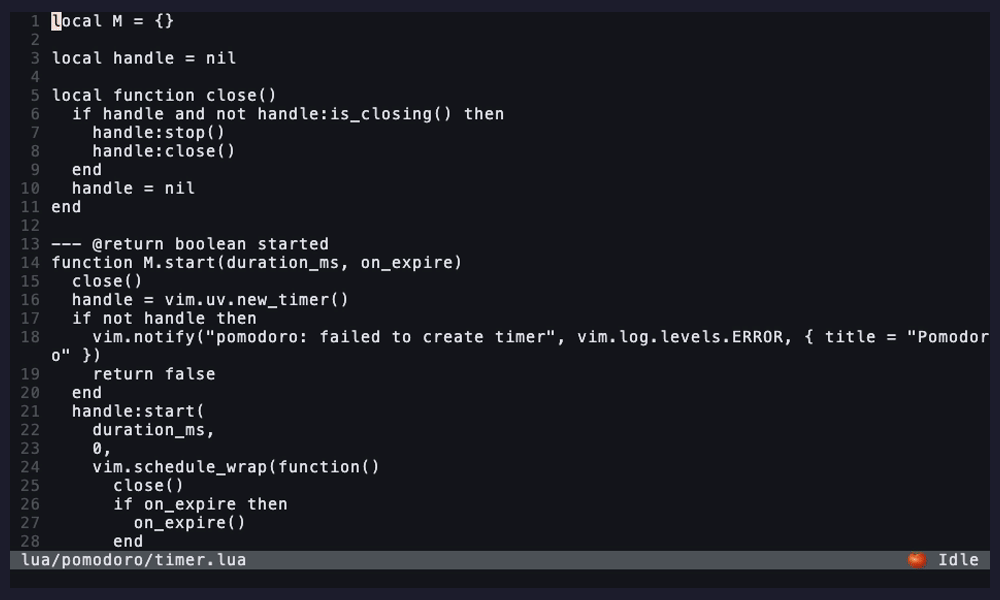

<div align="center">

# pomodoro.nvim

**A focus-first Pomodoro timer for developers who live in Neovim.**

_Work / break cycles, editor-native notifications, per-day stats, an opt-in focus mode that mutes distractions while you ship._

[](https://neovim.io)
[](https://www.lua.org/)
[](https://github.com/yal212/pomodoro.nvim/actions)
[](./LICENSE)
[](https://github.com/yal212/pomodoro.nvim/stargazers)

[Features](#-features) ·
[Install](#-installation) ·
[Quickstart](#-quickstart) ·
[Config](#-configuration) ·
[Commands](#-commands) ·
[API](#-lua-api) ·
[Recipes](#-recipes) ·
[FAQ](#-faq)

</div>

---

> [!NOTE]
> Place your demo gif at `assets/demo.gif` and uncomment the line below.
> <!--  -->

## ✨ Features

- 🍅 **Classic Pomodoro cycles** — 25 / 5 / 15 minute defaults, long break every 4th work block, all configurable
- 🔔 **Editor-native notifications** — `vim.notify` (lights up [`nvim-notify`](https://github.com/rcarriga/nvim-notify) / [`noice`](https://github.com/folke/noice.nvim) automatically) and/or a transient floating window
- 📊 **Per-day stats** — completed work blocks, focused minutes, long-break count, persisted atomically as JSON
- 🪟 **Toggleable status window** — pinned, borderless card with phase-colored header, live progress bar, and today counter
- 🛎️ **Continue / stop prompt** — when auto-start is off, each phase ends with a `vim.ui.select` asking whether to begin the next phase or stop
- 🎯 **Focus mode (opt-in)** — block configured `:` commands during work; optionally mute diagnostics
- 🧩 **Renderer-agnostic statusline** — drop-in component for `lualine`, `heirline`, or your own `statusline`
- 🔭 **Optional Telescope picker** — last 30 days at a glance, only loaded if Telescope is present
- 🪝 **Hooks** — `on_work_start`, `on_break_start`, `on_cycle_complete`, … wire your own behavior
- 🪶 **Zero required dependencies** — pure Lua, stdlib only
- ✅ **Tested** — 31 plenary-busted specs, CI on stable + nightly Neovim

## 📦 Requirements

- **Neovim** ≥ 0.10
- _Optional_ — [`telescope.nvim`](https://github.com/nvim-telescope/telescope.nvim) for the stats picker
- _Optional_ — [`nvim-notify`](https://github.com/rcarriga/nvim-notify) for prettier toasts (any `vim.notify` replacement works)

## 📥 Installation

<details open>
<summary><b>lazy.nvim</b></summary>

```lua
{
  "yal212/pomodoro.nvim",
  cmd = {
    "PomodoroStart", "PomodoroPause", "PomodoroResume",
    "PomodoroStop",  "PomodoroSkip",  "PomodoroStatus",
    "PomodoroStats", "PomodoroReset",
  },
  ---@type pomodoro.Config
  opts = {
    -- your config; see :help pomodoro-config
  },
}
```

</details>

<details>
<summary><b>packer.nvim</b></summary>

```lua
use({
  "yal212/pomodoro.nvim",
  config = function()
    require("pomodoro").setup({})
  end,
})
```

</details>

<details>
<summary><b>vim-plug</b></summary>

```vim
Plug 'yal212/pomodoro.nvim'

" In your init.lua, after plug#end():
lua require("pomodoro").setup({})
```

</details>

## 🚀 Quickstart

```vim
:PomodoroStart           " 25-minute work block
:PomodoroStatus          " toggle floating status window
:PomodoroPause           " pause; remaining time preserved
:PomodoroResume
:PomodoroStop
:PomodoroStats           " today + last 7 days
```

Suggested keymaps:

```lua
local map = vim.keymap.set
map("n", "<leader>ps", "<cmd>PomodoroStart<cr>",  { desc = "Pomodoro: start" })
map("n", "<leader>pp", "<cmd>PomodoroPause<cr>",  { desc = "Pomodoro: pause" })
map("n", "<leader>pr", "<cmd>PomodoroResume<cr>", { desc = "Pomodoro: resume" })
map("n", "<leader>px", "<cmd>PomodoroStop<cr>",   { desc = "Pomodoro: stop" })
map("n", "<leader>pw", "<cmd>PomodoroStatus<cr>", { desc = "Pomodoro: window" })
map("n", "<leader>pS", "<cmd>PomodoroStats<cr>",  { desc = "Pomodoro: stats" })
```

## ⚙️ Configuration

`setup()` is **not** required — defaults work out of the box. Pass any subset of the table below to override.

<details>
<summary><b>Click to view all defaults</b></summary>

```lua
require("pomodoro").setup({
  -- Phase durations (minutes)
  durations = {
    work        = 25,
    short_break = 5,
    long_break  = 15,
  },

  -- Long break every Nth completed work block
  cycles_per_long_break = 4,

  -- Phase transition behavior
  auto_start_break = true,   -- break begins immediately; if false a Continue/Stop prompt appears
  auto_start_work  = false,  -- next work block requires :PomodoroStart (or Continue from prompt)

  -- Notification channels (any subset, in display order)
  notify_styles = { "vim_notify", "float" },
  notify = {
    float_duration_ms = 4000,
    sound             = false, -- reserved; use a hook for now
  },

  -- Statusline component appearance
  statusline = {
    icon            = "",
    show_when_idle  = false,
    format          = "%s %s",     -- icon, body
    refresh_ms      = 250,         -- live tick while a phase is running
  },

  -- Toggleable pinned status window (borderless card)
  status_window = {
    border             = "none",
    width              = 36,
    height             = 5,
    anchor             = "NE",
    row                = 1,
    col_offset         = 2,
    refresh_ms         = 250,
    show_progress_bar  = true,
    show_today         = true,
    icons = {
      work        = "▶",
      short_break = "•",
      long_break  = "★",
      paused      = "❚❚",
      idle        = "○",
    },
  },

  -- Opt-in focus enforcement
  focus = {
    enabled            = false,
    blocked_commands   = {},  -- e.g. { "Lazy", "Mason", "Telescope" }
    silent_diagnostics = false,
    dim_inactive       = false,
  },

  -- JSON stats on disk
  persistence = {
    enabled = true,
    path    = nil,            -- nil → vim.fn.stdpath('data') .. '/pomodoro/stats.json'
  },

  -- Lifecycle hooks
  hooks = {
    on_work_start     = nil,  -- function(payload) end
    on_work_end       = nil,
    on_break_start    = nil,
    on_break_end      = nil,
    on_cycle_complete = nil,
  },
})
```

</details>

## 📋 Commands

| Command | Args | Description |
| :--- | :--- | :--- |
| `:PomodoroStart`  | `[work\|short\|long]` | Start a phase. Defaults to next in cycle, or resumes if paused. |
| `:PomodoroPause`  | — | Pause the active phase, preserving remaining time. |
| `:PomodoroResume` | — | Resume a paused phase. |
| `:PomodoroStop`   | — | Stop and reset to idle. |
| `:PomodoroSkip`   | — | End the current phase immediately and advance. |
| `:PomodoroStatus` | — | Toggle the floating status window. |
| `:PomodoroStats`  | — | Show today + last 7 days summary. |
| `:PomodoroReset`  | — | Wipe persisted stats (with confirm prompt). |

## 🧰 Lua API

```lua
local pomo = require("pomodoro")

pomo.setup({})                           -- merge config (idempotent)
pomo.start("work" | "short" | "long" | nil)
pomo.pause()
pomo.resume()
pomo.stop()
pomo.skip()
pomo.status()                            -- toggle status window
pomo.stats_summary()                     -- print today + week via vim.notify
pomo.reset_stats()
pomo.statusline()                        -- string for your statusline

-- Lower level
require("pomodoro.statusline").component()         -- string
require("pomodoro.statusline").component_lualine() -- { text, hl }
require("pomodoro.stats").today()                  -- table
require("pomodoro.stats").last_n_days(7)           -- table[]
```

## 🍳 Recipes

<details open>
<summary><b>Lualine — drop-in</b></summary>

```lua
require("lualine").setup({
  sections = {
    lualine_x = {
      function() return require("pomodoro.statusline").component() end,
      "encoding", "fileformat", "filetype",
    },
  },
})
```

</details>

<details>
<summary><b>Lualine — colored by phase</b></summary>

```lua
local function pomo()
  local s = require("pomodoro.statusline").component_lualine()
  if s.text == "" then return "" end
  return "%#" .. s.hl .. "#" .. s.text
end

require("lualine").setup({
  sections = { lualine_x = { pomo, "filetype" } },
})
```

</details>

<details>
<summary><b>Native statusline (no plugin)</b></summary>

```lua
vim.o.statusline = "%f %m %= %{v:lua.require('pomodoro').statusline()} "
```

</details>

<details>
<summary><b>System notification on break (macOS)</b></summary>

```lua
require("pomodoro").setup({
  hooks = {
    on_break_start = function(p)
      vim.fn.jobstart({
        "terminal-notifier",
        "-title", "Pomodoro",
        "-message", "Break time — " .. p.duration_min .. " min",
        "-sound", "Glass",
      })
    end,
  },
})
```

</details>

<details>
<summary><b>System notification on break (Linux)</b></summary>

```lua
require("pomodoro").setup({
  hooks = {
    on_break_start = function(p)
      vim.fn.jobstart({ "notify-send", "Pomodoro", "Break — " .. p.duration_min .. " min" })
    end,
  },
})
```

</details>

<details>
<summary><b>Lock yourself out of distractions while working</b></summary>

```lua
require("pomodoro").setup({
  focus = {
    enabled = true,
    blocked_commands   = { "Lazy", "Mason", "Telescope" },
    silent_diagnostics = true,
  },
})
```

</details>

## 🔭 Telescope

If `nvim-telescope/telescope.nvim` is installed, an extension is registered automatically:

```vim
:Telescope pomodoro stats
```

Last 30 days; preview pane shows that day's breakdown (work blocks, long breaks, minutes focused).

## 🩺 Health

```vim
:checkhealth pomodoro
```

Reports Neovim version, data-dir writability, and which optional integrations are available.

## ❓ FAQ

<details>
<summary><b>Why is the status window not updating?</b></summary>

The status window refreshes every 250 ms while it's open. A separate uv timer runs `:redrawstatus` at the same cadence whenever a phase is active, so any statusline component (lualine, heirline, native) ticks too. Both intervals are configurable via `status_window.refresh_ms` and `statusline.refresh_ms`. If you use lualine in `lazy` mode and want even smoother ticks, lower its `refresh.statusline` interval as well.

</details>

<details>
<summary><b>Does the timer keep running if I close Neovim?</b></summary>

No. The timer is in-process. Stats are flushed on `VimLeavePre`, but an active phase is dropped — by design, since the editor is the focus surface.

</details>

<details>
<summary><b>How do I get desktop notifications?</b></summary>

Use a `hook` — see the [Recipes](#-recipes) for `terminal-notifier` (macOS) and `notify-send` (Linux) examples. Cross-platform sound is intentionally out of scope.

</details>

<details>
<summary><b>Where is my stats file?</b></summary>

`vim.fn.stdpath("data") .. "/pomodoro/stats.json"`. Override via `persistence.path`. The file is rewritten atomically (temp file + rename) and a corrupt file is moved aside as `stats.json.bak`, never crashing the plugin.

</details>

<details>
<summary><b>Can I use this without a statusline plugin?</b></summary>

Yes — see the native-statusline recipe above, or just `:PomodoroStatus` to keep a pinned floating window with the live countdown.

</details>

## 🛠️ Development

```sh
# Run the test suite (auto-clones plenary into tests/.deps/)
nvim --headless --noplugin -u tests/minimal_init.lua \
  -c "PlenaryBustedDirectory tests/pomodoro/ {minimal_init = 'tests/minimal_init.lua'}"

# Format
stylua lua/ tests/ plugin/ scripts/

# Lint
luacheck lua/ plugin/

# Quick interactive sandbox (1-minute phases)
nvim --clean -u scripts/dev_init.lua
```

## 🗺️ Roadmap

- [ ] Demo GIF in README
- [ ] Sound cues via cross-platform helper hook
- [ ] Optional weekly heatmap (extmarks)
- [ ] DAP-aware "in debug session" auto-pause
- [ ] Multi-instance coordination across Neovim windows

Have an idea? [Open an issue](https://github.com/yal212/pomodoro.nvim/issues).

## 🤝 Contributing

Issues and PRs welcome. Please:

1. Run the test suite and `stylua --check` before submitting
2. Add a spec for any new behavior
3. Keep runtime deps at zero — Telescope/notify integration must remain optional

## 🙏 Acknowledgements

- Francesco Cirillo for the [Pomodoro Technique](https://francescocirillo.com/pages/pomodoro-technique)
- The Neovim core team for `vim.uv`, `vim.notify`, `vim.json`, and `:checkhealth`
- [`nvim-lua/plenary.nvim`](https://github.com/nvim-lua/plenary.nvim) for the test harness

## 📄 License

[MIT](./LICENSE) © yal212

<div align="center">
<sub>If this plugin helps you ship, drop a ⭐ — it's the cheapest way to say thanks.</sub>
</div>
